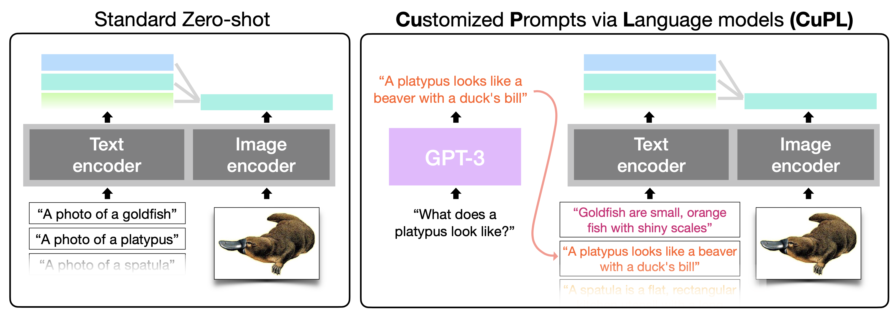

## Generating customized prompts for zero-shot image classification

This repository contains code to:

1. Generate your own customized prompts using GPT-3
2. Classify ImageNet using your own (or provided) generated customized prompts

Python version 3.8.9

:warning: Currently this repository only supports the ImageNet dataset. Additional datasets coming soon.



## Generating prompts with GPT-3

To generate prompts, run the below command:

```
python generate_image_prompts.py
```

Additionally, in that file you will need to specify your own openai beta API key (https://beta.openai.com/) and the name of the json file where you wish to write your generated prompts. You can adjust this in the following lines of the above file:

```
openai.api_key = "INSERT YOUR OPENAI BETA API KEY"
json_name = "json_name.json"
```

Finally, you can specify desires hyperparameters for generation including thee number of sentences you wish to generate (currently 10), temperature (currently .99), if you wish to stop after generating a given token ("."),  and max tokens (currently 50). Additional documentation can be found here: https://beta.openai.com/docs/api-reference/completions/create.

```
openai.Completion.create(
	engine="text-davinci-002",
	prompt=curr_prompt,
	temperature=.99,
	max_tokens = 50,
	n=10,
	stop="."
	)
```


## Zero-shot Image Classification with CLIP

Classify ImageNet using these prompts run the below command:

```
python classify_imagenet.py
```

Additionally, you will need to specify the path to ImageNet on your machine as well as the path to your (or provided) generated prompts. You can do that in the beginning of the above file in the following two lines of code:

```
PATH_TO_IMAGENET = "../val"
PATH_TO_PROMPTS = "./imagenet_prompts/CuPL_image_prompts.json"
```
